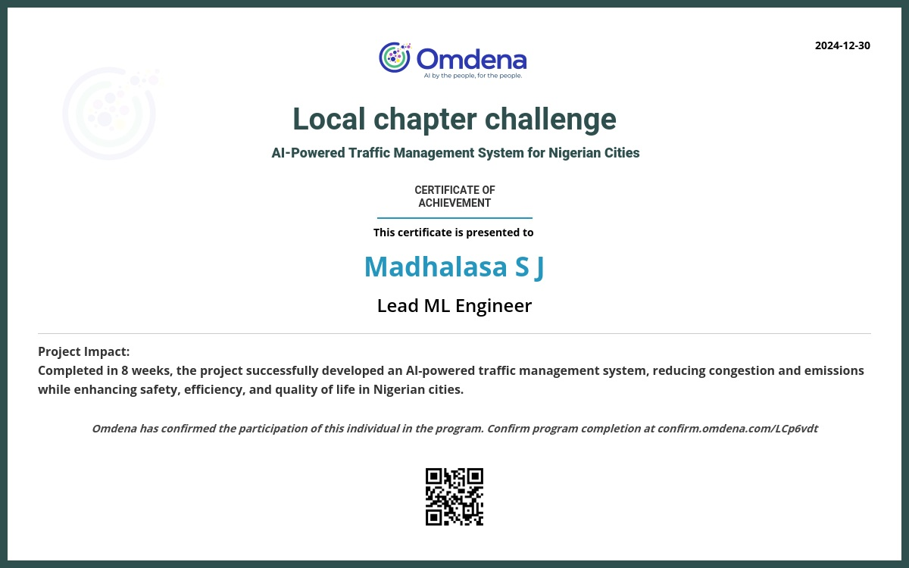

# Traffic Prediction using Bi-Directional LSTM

# AI Traffic Simulation

This repository showcases my work on an **AI Traffic Simulation** project as part of an **Omdena** collaboration. The project focused on using AI to optimize urban traffic management.

## My Role
- Developed a traffic prediction model using LSTM networks.
- Led Task-3: Traffic Control Algorithm Model Development.
- Conducted daily stand-ups and managed progress using a sprint methodology.

## Certificate of Completion

## About Omdena
[Omdena](https://omdena.com) is a global platform where AI practitioners collaborate to solve real-world challenges.

## Project Overview

This project aims to predict traffic conditions, specifically traffic light signals and traffic volume, using a **Bi-directional Long Short-Term Memory (LSTM)** model. It processes time-series traffic data and trains a multi-task learning model that predicts both traffic light status and traffic volume.

## Objectives

The goal of this project is to enhance traffic management systems by providing predictions that can optimize traffic control. The key tasks include:

1. **Traffic Light Status**: A classification task that predicts the current status of the traffic light (e.g., red, yellow, green).
2. **Traffic Volume**: A regression task that predicts the number of vehicles on the road.

## Approach

This project leverages the power of **Bi-directional LSTM (Bi-LSTM)** to learn from both past and future traffic data, enhancing the model's ability to capture patterns in traffic behavior. The tasks include:
- **Data Collection**: Gathering time-series traffic data with relevant features (e.g., timestamps, traffic light status, vehicle count).
- **Data Preprocessing**: Handling missing data, scaling, and transforming the dataset into a suitable format for training.
- **Model Development**: Building a Bi-directional LSTM model with two output layers for classification (traffic light status) and regression (traffic volume).
- **Model Training**: Training the Bi-LSTM model with appropriate loss functions for both tasks.
- **Evaluation**: Evaluating the model's performance using metrics such as accuracy (for classification) and mean squared error (for regression).

## Features

- **Multi-Task Learning**: Simultaneously predicts both traffic light status and traffic volume using a single model.
- **Bi-LSTM Architecture**: Captures both forward and backward dependencies in the time-series data.
- **Real-time Traffic Predictions**: Can be used to predict traffic light status and vehicle count for real-time traffic management.

## Video Demonstration

You can view the video demonstration of the traffic management model by clicking the link below:

[Watch the video](assets/AI-Traffic_Management_video_sumo.mp4)
  
